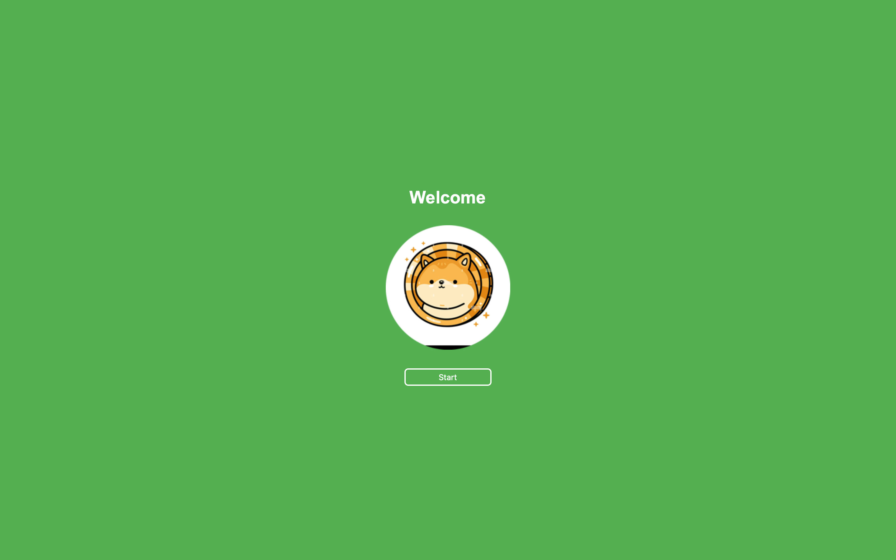
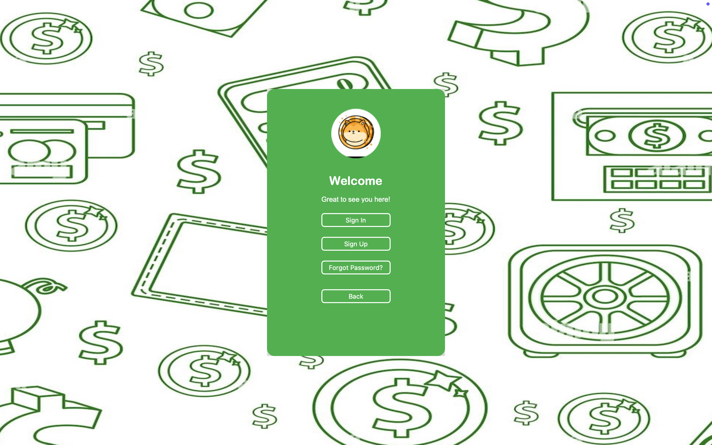
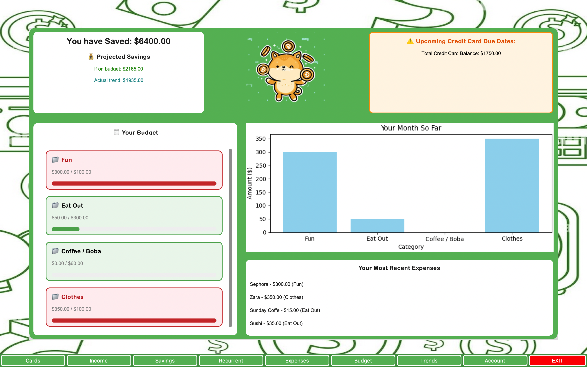
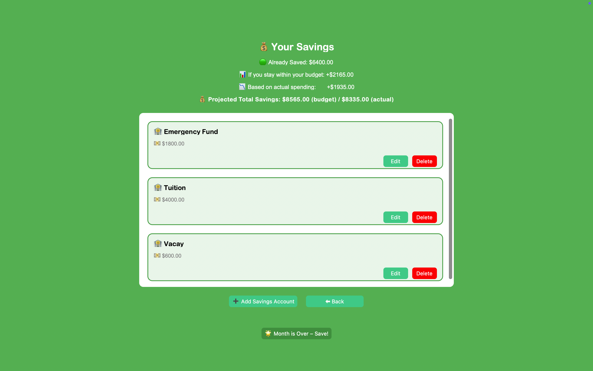

# 💸 BrokeBuddy  

**Group Members:**  
- Margarita Rincon Matamoros  
- Tien Pham  

---

## 📖 Project Description  
**BrokeBuddy** is a **Python-based desktop budgeting application** designed to help College Students track and manage their personal finances.  

🔹 Features include:  
- Add income, record expenses, and manage debit/credit cards  
- Track savings and recurring charges  
- Generate spending graphs & insights with Matplotlib  
- Dashboard view for an all-in-one summary  
- Offline-first design with secure local JSON storage  

---

## 🛠️ Tech Stack  

  
  
  
  
  
  

---

## 📦 Dependencies  

Install dependencies with:  
pip install -r requirements.txt

Application runs from 
			python UI.py

## 📸 Screenshots  

**Initial View**
 

**Login Screen**  
 

**Dashboard View**  
  

**Savings**  
  

**User View**  
  

## File Structure & Overview

BrokeBuddy/  
│  
├── logic/                 # Core backend logic  
│   ├── auth.py            # Handles user authentication and login  
│   ├── budget.py          # Budget calculations and limit logic  
│   ├── charts.py          # Creates graphs for spending insights  
│   ├── models.py          # OOP classes: User, Card, Expense  
│   ├── resetter.py        # Handles new month resets  
│   ├── savings.py         # Calculates savings  
│   └── storage.py         # Loads and saves user data to JSON  
│
├── views/                 # All GUI Frames (CustomTkinter-based)  
│   ├── account.py  
│   ├── budgetFrame.py  
│   ├── cards.py  
│   ├── dashboard.py  
│   ├── ExpensesFrame.py  
│   ├── ForgotFrame.py  
│   ├── graphs.py  
│   ├── income.py  
│   ├── LogInSignUp.py  
│   ├── recurrent.py  
│   ├── savings.py  
│   ├── SignIn.py  
│   ├── SignUp.py  
│   └── welcomeFrame.py  
│  
├── Data.json              # Main local data storage file  
├── menu.py                # Used during early terminal testing  
├── UI.py                  # Launches the main window and controls navigation  
├── requirements.txt       # Lists required Python packages  

--

#Limitations  
The Console Menu Playground in menu.py does not fully work anymore due to new changes to the data model.